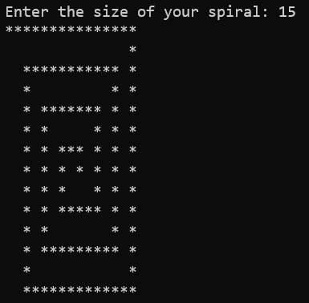

# Spiral

A simple CLI application for writing a spiral of user defined size to the console.

## How to Run:
* Clone this repository.
* Navigate into the project directory.
* Enter `dotnet run` into the command line.
* When prompted, enter an integer to create a square spiral of that size.

## Example:
